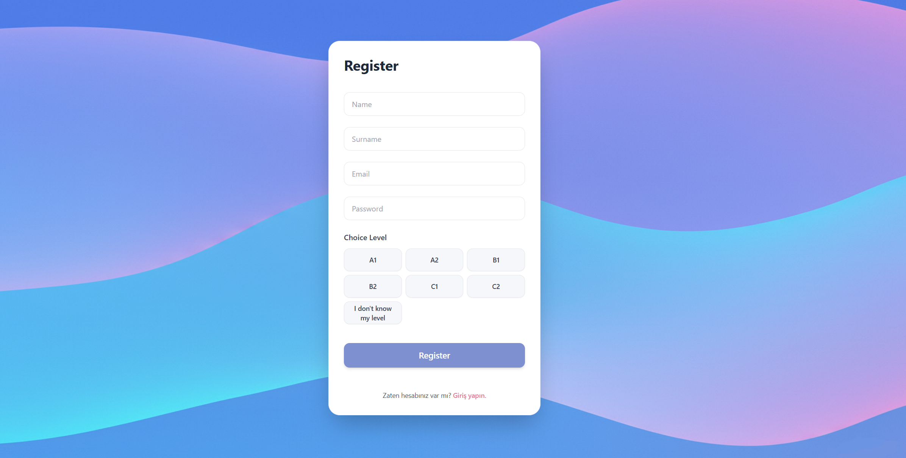
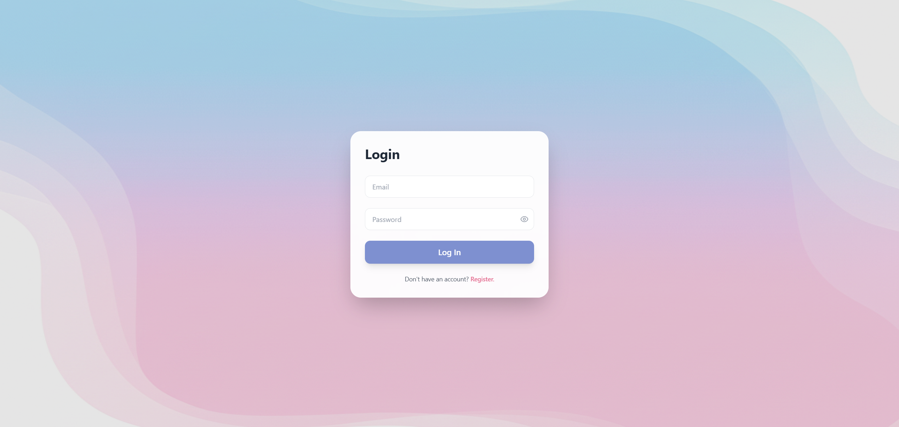
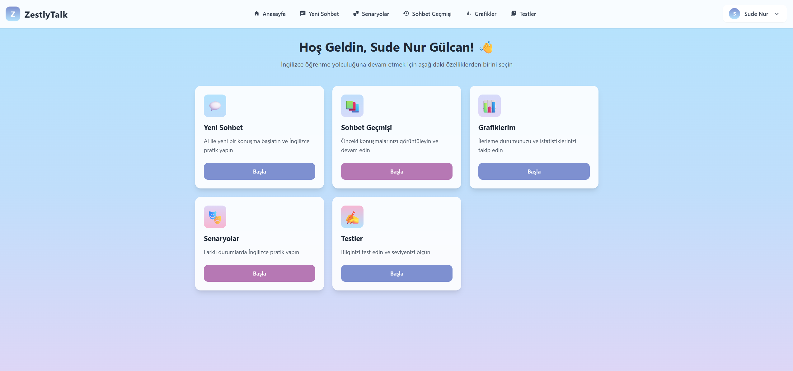
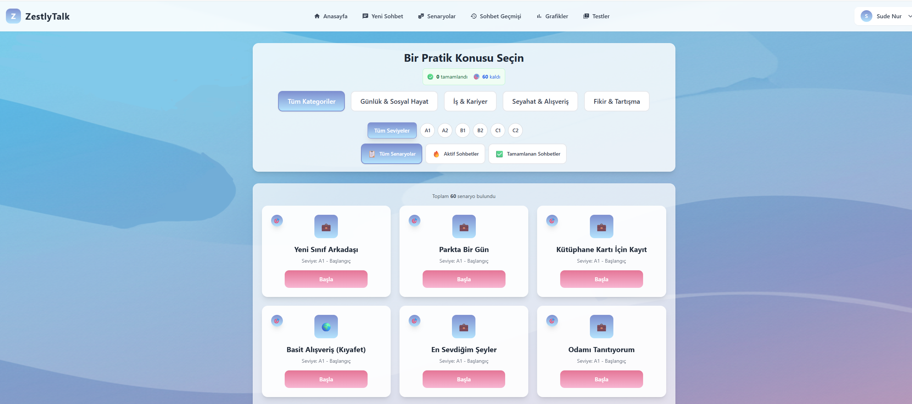
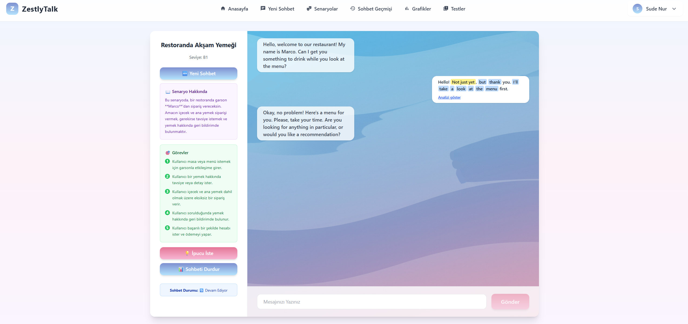
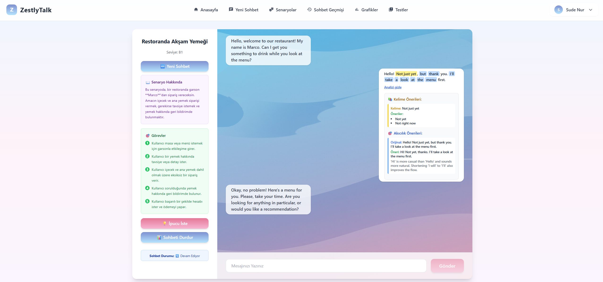
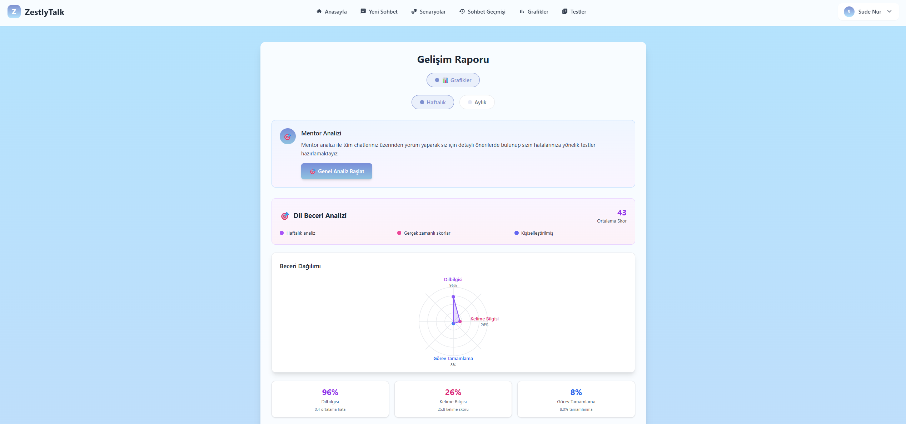
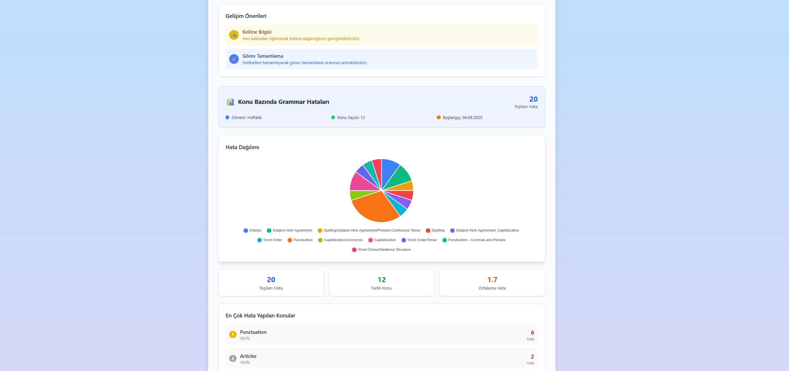
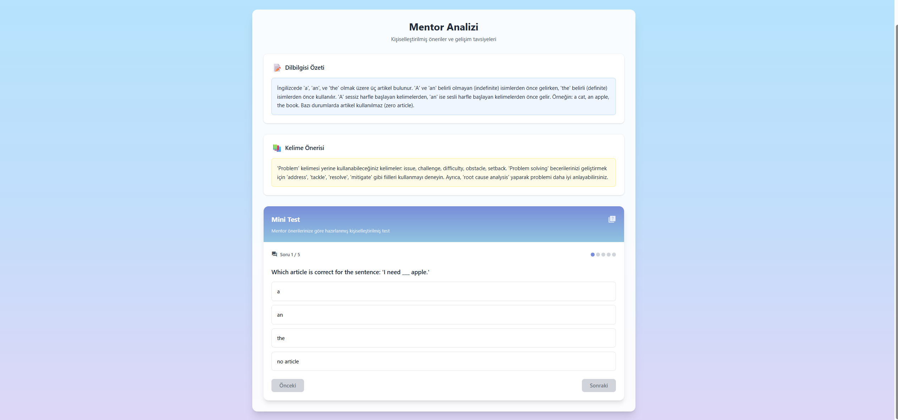

# 🧠 ZestlyTalk: AI Destekli Kişiselleştirilmiş İngilizce Konuşma Asistanı

## 🔍 Proje Hakkında
Bu proje, İngilizce konuşma pratiği yapmak isteyen kullanıcılar için yapay zeka destekli, seviyeye göre özelleştirilmiş, senaryoya dayalı ve etkileşimli bir dil öğrenme platformudur. Kullanıcılar, yazılı olarak İngilizce konuşmalar gerçekleştirir.

Her mesaj; gramer, kelime bilgisi, akıcılık ve hedeflere uygunluk açısından analiz edilir. Sistem; A1’den C2’ye kadar CEFR seviyelerine uygun özel senaryolar, analizler ve geri bildirimler sunar.

Platform, gerçek zamanlı yapay zeka analizi ve modüler görev tabanlı konuşma yapısı ile her seviyedeki öğrenicinin ihtiyacına hitap eder.

## 🎯 Projenin Amacı
- Öğrencilerin İngilizce konuşma pratiğini etkileşimli hale getirmek.

- Gerçek hayata uygun rol bazlı senaryolar ile bağlamsal öğrenme sunmak.

- Anında ve kişiselleştirilmiş geri bildirimlerle öğrenme sürecini hızlandırmak.

- Oyunsal unsurlarla (puan, seviye, rozetler) motivasyonu artırmak.

- Yabancı dil öğrenen bireyleri dijital bir mentor ile desteklemek.

## 👥 Hedef Kitle
- A1 – C2 düzeyinde İngilizce öğrenen bireyler

- IELTS / TOEFL sınavlarına hazırlananlar

- Yabancı dil eğitmenleri ve kursları

- Profesyonel iş görüşmesi veya toplantılara hazırlık yapanlar

- Kendi kendine İngilizce öğrenen bireyler

## 🚀 Temel Özellikler ve Agent Mimarisi
Proje, her biri özel bir göreve odaklanmış modüler Agent'lardan oluşur:

## 🎭 RoleplayAgent – Senaryoya Dayalı Konuşmalar
Kullanıcıya belirli bir rol (turist, ev sahibi, müşteri vb.) atanır ve CEFR seviyesine uygun bir konuşma senaryosu sunulur. 

Her senaryoda kullanıcının tamamlaması gereken konuşma görevleri (milestone) tanımlanır.

Kullanıcıya Katkısı: Gerçek hayatta karşılaşabileceği durumlara hazırlanır, görevleri yerine getirirken pratik yapar ve hedef odaklı konuşma alışkanlığı kazanır.

## ✏️ GrammarAnalysisAgent – Gramer Analizi
Her kullanıcı mesajı, dilbilgisel olarak analiz edilir. Hatalı yapılar belirlenir, açıklanır ve kullanıcıya doğru örneklerle birlikte sunulur.

Kullanıcıya Katkısı: Yaptığı gramer hatalarını anında öğrenir, neden yanlış olduğunu kavrar ve konu bazlı gelişim gösterir.

## 📚 VocabularyAnalysisAgent – Kelime Bilgisi Analizi
Kullanıcının kullandığı kelimeler CEFR seviyelerine göre sınıflandırılır. Basit–orta–ileri düzey ayrımı yapılır ve gelişim için öneriler sunulur.

Kullanıcıya Katkısı: Kelime dağarcığını zenginleştirir, hedef seviyesine uygun kelimeler öğrenir ve daha çeşitli ifadeler kullanma becerisi kazanır.

## 🗣️ FluencyAgent – Akıcılık Geliştirme
Kullanıcının cümleleri, doğal ve akıcı hale getirilecek şekilde yeniden yazılır. Her öneri kısa bir açıklama ile birlikte verilir.

Kullanıcıya Katkısı: Anadili İngilizce olan konuşmacılara yakın ifade becerisi kazanır ve yapay veya çeviri kokan cümlelerden uzaklaşır.

## 💬 FreeTalkAgent – Serbest Sohbet
Kullanıcı, herhangi bir senaryo olmaksızın doğal bir sohbet başlatabilir. Model, arkadaşça ve teşvik edici şekilde yanıt verir.

Kullanıcıya Katkısı: Özgür konuşma pratiği yapar, sohbet ederken stres yaşamaz ve İngilizcesini serbestçe test eder.

## 🧑‍🏫 MentorAgent – Mentorluk ve Mini Testler
Kullanıcının geçmiş konuşmalarındaki sık yapılan hataları analiz eder. Bu hatalara özel 5 soruluk mini testler sunar ve kişiselleştirilmiş gelişim önerileri üretir.

Kullanıcıya Katkısı: Kendi gelişim alanlarını tanır, hedefli tekrar yapar ve önerilen mini testlerle bilgisini pekiştirir.

## 📈 ConversationSummaryAgent – Konuşma Özeti ve Geri Bildirim
Konuşmanın sonunda Türkçe olarak genel başarı değerlendirmesi, kişiselleştirilmiş öneriler ve puanlama sunar.

Kullanıcıya Katkısı: Hangi alanlarda güçlü/zayıf olduğunu öğrenir, CEFR uyumluluğu hakkında bilgi alır ve gelişim için net yönlendirme kazanır.

## ✅ MilestoneCheckAgent – Görev Takipçisi
Senaryo konuşmalarındaki hedef görevlerin (milestones) başarıyla tamamlanıp tamamlanmadığını otomatik olarak algılar ve ilerleme durumunu günceller.

Kullanıcıya Katkısı: Hedef odaklı ilerleme sağlar, tamamladığı görevleri takip eder ve konuşma boyunca rehberlik alır.

## 💡 HintAgent – İpucu Sistemi
Kullanıcı konuşma esnasında takılırsa bağlama özel kısa, doğal ve yönlendirici ipuçları sunar.

Kullanıcıya Katkısı: Ne diyeceğini bilemediği anlarda destek alır ve akıcılığı bozulmadan devam edebilir.

## 📊 VocabularyLevelAgent – Kelime Seviyesi Skoru
Kullanıcının kelime seçimlerini analiz eder ve seviyesine göre bir "kelime skoru" hesaplar. Bu skor, genel performans puanına katkı sağlar.

Kullanıcıya Katkısı: Kelime bilgisinin seviyeye uygunluğunu görür ve akademik ya da profesyonel hedefler için uygunluk değerlendirmesi alır.

# 💻 Frontend Kullanıcı Arayüzü
Projenin frontend kısmı, modern web uygulamaları geliştirmede yaygın olarak kullanılan React kütüphanesi ile geliştirilmiştir.

Kullanıcı deneyimi ön planda tutularak tasarlanan arayüz, sezgisel navigasyon yapısı ve sade tasarımı ile kullanıcıların ihtiyaç duyduğu tüm özelliklere kolayca ulaşabilmesini sağlar.

Tüm sayfalar responsive olup mobil cihazlarla tam uyumludur. Ayrıca, AuthGuard ve TokenValidator bileşenleriyle güvenli erişim ve oturum yönetimi sağlanmıştır.

## 🧠 Teknik Mimarisi
Her agent modüler yapıdadır ve bağımsız test edilebilir. Sistem, scalable (ölçeklenebilir) ve maintainable (sürdürülebilir) şekilde tasarlanmıştır.

## 📁 Klasör Yapısı:
agents/ → AI ajanları

services/ → Gemini API servisleri

helpers/ → CEFR & prompt yöneticileri

controllers/ → API kontrol noktaları

models/ → Sequelize veri modelleri

utils/ → Yardımcı fonksiyonlar

config/ → Ortam yapılandırmaları (.env)

## ⚙️ Kullanılan Teknolojiler
| Teknoloji | Açıklama |
|-----------|-----------|
| Node.js | Sunucu taraflı çalıştırma ortamı |
| Express.js | RESTful API framework |
| PostgreSQL | İlişkisel veritabanı sistemi |
| Sequelize | ORM – veri modelleme ve sorgulama |
| Google Gemini API | AI tabanlı metin üretimi ve analiz |
| React.js | Frontend için bileşen tabanlı arayüz kütüphanesi |
| Redux Toolkit | Uygulama genelinde durum yönetimi |
| JavaScript (ES6+) | Proje dili |
| MVC Architecture | Katmanlı ve modüler yazılım mimarisi |

## 🧪 Nasıl Çalışır?
Kullanıcı bir konuşma başlatır (senaryo veya serbest).

Gönderilen her mesaj, ilgili agent'lar tarafından paralel olarak analiz edilir.

AI modelinden gelen cevap ve analizler veritabanına kaydedilir.

Konuşma sonunda ConversationSummaryAgent genel bir değerlendirme sunar ve MentorAgent kişiye özel test ve yönlendirmeler üretir.

## 🔐 Güvenlik ve Gizlilik
Tüm veriler anonimleştirilir.

API anahtarları .env dosyasında saklanır ve asla public repolara gönderilmez.

Kişisel veriler üçüncü kişilerle paylaşılmaz.

Analiz için loglanan veriler, gizlilik ilkelerine uygun şekilde saklanır.

## 📸 Ekran Görüntüleri











## 🛠️ Başlangıç Rehberi
### Projeyi Klonlayın
```bash
git clone https://github.com/sudenurGlcn/ZestlyTalk.git
cd ZestlyTalk
```
### 📁 .env Dosyasını Yapılandırın
Projenin server klasörü içinde .env adında bir dosya oluşturun ve içine API anahtarınızı ekleyin:

#### .env
```env
GEMINI_API_KEY=your-api-key
GEMINI_API_URL=https://generativelanguage.googleapis.com/v1
```
#### Veritabanı bağlantı bilgileriniz
```env
DB_USER=postgres
DB_PASSWORD=your_password
DB_HOST=localhost
DB_PORT=5432
DB_NAME=your_database_name
```
### 🚀 Sunucu (Backend) Kurulumu
#### Proje ana dizininden server klasörüne geçin
```bash
cd server
```
#### Gerekli paketleri yükleyin
```bash
npm install
```
#### Sunucuyu başlatın
```bash
npm start
```
### 💻 İstemci (Frontend) Kurulumu
#### Proje ana dizininden client klasörüne geçin
```bash
cd client
```
#### Gerekli paketleri yükleyin
```bash
npm install
```
#### React uygulamasını başlatın
```bash
npm start
```
## 💡 Neden Bu Proje?
Gerçek hatalara dayalı kişiselleştirilmiş öğrenme sunar.

A1'den C2'ye her seviyeye uygun senaryolar içerir.

AI destekli mentor sistemi ile sürdürülebilir gelişim sağlar.

Eğitim platformları için yenilikçi ve etkili bir çözümdür.

Kullanıcı dostu arayüzü ile öğrenme deneyimini sadeleştirir ve hızlandırır.


## 📄 Lisans

Bu proje GPLv3 lisansı altında lisanslanmıştır. Daha fazla bilgi için [LICENSE](LICENSE) dosyasına bakınız.

